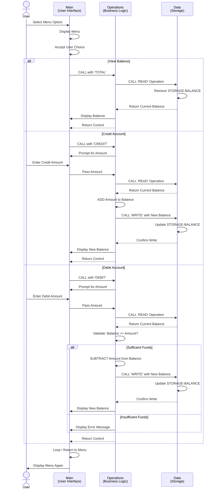

# Student Account Management System - COBOL Documentation

## Overview

This documentation provides a comprehensive guide to the Student Account Management System, a COBOL-based application designed to manage student financial accounts. The system follows a modular architecture with separate programs handling user interface, business logic, and data storage operations.

---

## COBOL Files

### 1. **main.cob** - Main Program & User Interface

**Purpose:**
The entry point of the Student Account Management System. Provides a menu-driven command-line interface for users to access account management operations.

**Key Functions:**
- **Menu Display**: Presents a user-friendly menu with four options:
  1. View Balance - Display current account balance
  2. Credit Account - Add funds to the account
  3. Debit Account - Withdraw funds from the account
  4. Exit - Terminate the program
- **Menu Loop**: Continuously displays the menu until the user selects the exit option
- **Program Routing**: Routes user selections to the Operations program with the appropriate operation type

**Program Logic Flow:**
1. Displays the account management menu
2. Accepts user input (choice 1-4)
3. Uses EVALUATE statement to process the selected choice
4. Calls the Operations program with the operation type ('TOTAL', 'CREDIT', 'DEBIT', or exit)
5. Repeats until user selects "Exit"

**Variables:**
- `USER-CHOICE`: Numeric value (1-4) capturing user selection
- `CONTINUE-FLAG`: Flag to control the program loop ('YES' or 'NO')

---

### 2. **data.cob** - Data Storage & Persistence

**Purpose:**
Manages persistent account data storage and retrieval. Acts as the data layer for the system, handling read and write operations to student account balances.

**Key Functions:**
- **READ Operation**: Retrieves the current account balance from storage
- **WRITE Operation**: Updates and persists the account balance to storage
- **Data Validation**: Maintains data integrity through structured data handling

**Business Rules:**
- **Initial Balance**: Each student account is initialized with a balance of **$1,000.00**
- **Balance Format**: All balances are stored as 6-digit numbers with 2 decimal places (PIC 9(6)V99)
- **Data Persistence**: Uses WORKING-STORAGE for in-session data persistence

**Program Logic Flow:**
1. Checks the operation type passed from calling program
2. If 'READ': Retrieves current balance from STORAGE-BALANCE and passes it back
3. If 'WRITE': Receives new balance and updates STORAGE-BALANCE
4. Returns control to calling program

**Variables:**
- `STORAGE-BALANCE`: The persistent account balance (initialized to 1000.00)
- `OPERATION-TYPE`: Type of operation to perform ('READ' or 'WRITE')
- `PASSED-OPERATION`: Receives operation type from calling program
- `BALANCE`: Linkage variable for exchanging balance data

---

### 3. **operations.cob** - Business Logic & Account Operations

**Purpose:**
Implements the core business logic for account operations. Orchestrates interactions between the main program and data storage layer to execute credit, debit, and balance inquiry operations.

**Key Functions:**

#### **TOTAL Operation** (View Balance)
- Retrieves and displays the current account balance
- No balance modification
- Operation code: 'TOTAL '

#### **CREDIT Operation** (Deposit Funds)
- Prompts user for amount to deposit
- Retrieves current balance from data storage
- Adds the credit amount to the current balance
- Saves updated balance to data storage
- Displays confirmation with new balance
- Operation code: 'CREDIT'

#### **DEBIT Operation** (Withdraw Funds)
- Prompts user for amount to withdraw
- Retrieves current balance from data storage
- **Validates** that sufficient funds are available (prevents overdrafts)
- If funds are available: Subtracts amount and saves updated balance
- If insufficient funds: Displays error message and does NOT process withdrawal
- Displays confirmation with new balance (if successful)
- Operation code: 'DEBIT '

**Business Rules - Student Account Constraints:**

| Rule | Description | Enforcement |
|------|-------------|-------------|
| **No Overdrafts** | Student accounts cannot go negative | Debit operation validates balance before executing |
| **Initial Credit** | New accounts start with $1,000.00 | Set in data.cob STORAGE-BALANCE |
| **Precision** | All amounts use currency format (2 decimals) | PIC 9(6)V99 data type |
| **Transaction Logging** | Current system displays balance after operations | Manual confirmation in operations.cob |
| **Access Control** | All operations require menu selection | User intent validated through main.cob |

**Program Logic Flow:**
1. Receives operation type from main program
2. Based on operation type:
   - **VIEW**: Calls DataProgram to read balance, displays it
   - **CREDIT**: Accepts amount, reads balance, adds amount, writes updated balance, confirms
   - **DEBIT**: Accepts amount, reads balance, validates funds, subtracts (if valid), writes update, confirms
3. Returns control to main program

**Variables:**
- `OPERATION-TYPE`: The type of operation to perform
- `AMOUNT`: The transaction amount entered by user
- `FINAL-BALANCE`: Current or updated account balance
- `PASSED-OPERATION`: Receives operation type from main program

---

## System Architecture

```
┌─────────────────────────────────────┐
│      main.cob                       │
│   (User Interface & Menu)           │
└────────────┬────────────────────────┘
             │ (operation type)
             ▼
┌─────────────────────────────────────┐
│      operations.cob                 │
│   (Business Logic & Validation)     │
├──────────────────────────────────────┤
│ • TOTAL - View Balance              │
│ • CREDIT - Deposit Funds            │
│ • DEBIT - Withdraw Funds            │
│ • Overdraft Prevention              │
└────────────┬────────────────────────┘
             │ (read/write operations)
             ▼
┌─────────────────────────────────────┐
│      data.cob                       │
│   (Data Storage & Persistence)      │
├──────────────────────────────────────┤
│ • Manages STORAGE-BALANCE           │
│ • Handles READ/WRITE operations     │
│ • Maintains data integrity          │
└─────────────────────────────────────┘
```

---

## Data Model

**Student Account Record:**
```
Balance: PIC 9(6)V99  (6 digits, 2 decimal places)
Range: $0.00 - $999,999.99
Initial Value: $1,000.00
```

---

## Usage Example

```
Menu Interaction:
1. User selects "2. Credit Account"
2. main.cob calls operations.cob with 'CREDIT'
3. operations.cob prompts for amount (e.g., 500.00)
4. operations.cob calls data.cob to READ current balance (1000.00)
5. operations.cob ADDs 500.00 to balance (= 1500.00)
6. operations.cob calls data.cob to WRITE updated balance
7. operations.cob displays: "Amount credited. New balance: 1500.00"
8. Control returns to main.cob menu

Overdraft Prevention Example:
1. User selects "3. Debit Account"
2. operations.cob prompts for amount (e.g., 2000.00)
3. operations.cob reads balance (1500.00)
4. operations.cob validates: 1500.00 < 2000.00 ❌
5. operations.cob displays: "Insufficient funds for this debit."
6. Balance remains unchanged (1500.00)
```

---

## Modernization Opportunities

This legacy COBOL system is a candidate for modernization, including:
- Migration to object-oriented architecture
- RESTful API interface replacement of command-line menu
- Database integration for persistent storage
- Enhanced error handling and logging
- Transaction audit trail implementation
- Role-based access control

---

## System Data Flow - Sequence Diagram



